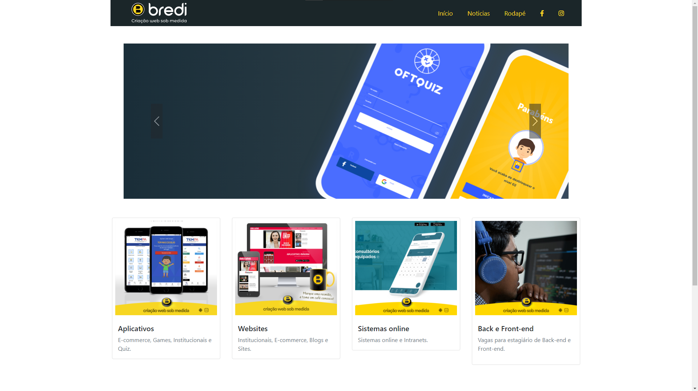
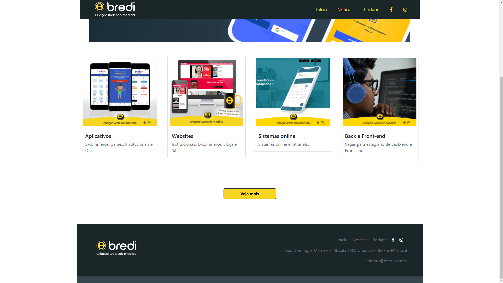

# Desafio - Bredi criação de sites sobre medida

Desafio-para-Front-end

## Recursos

* O Desafio foi feito para uma vaga de desenvolvedor front-end Jr.
* O Desafio foi desenvolvido com JavaScript, CSS, HTML, BootStrap.
* O Desafio foi feito usando tecnologias que nos permite deixar a página responsiva, flexiva, organizada, clean code, sintaxe, semântica e adaptado para diversos dispositivos e acessibilidade.

## Uso

1. Clone o repositório do GitHub.
2. Abra o projeto no seu editor de código.
3. Basca abrir o arquivo index.html para acessar a página, está página é estática!

## Créditos

Este projeto foi criado por Alaska Websites.

